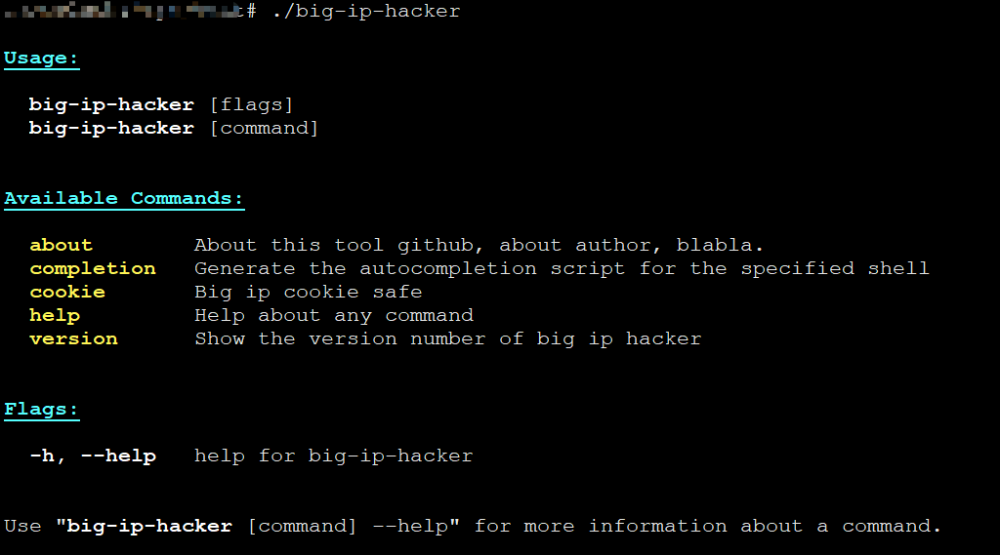
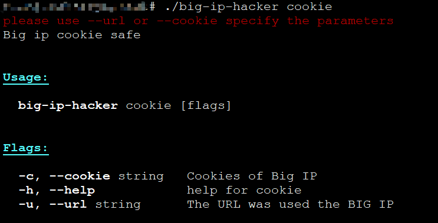
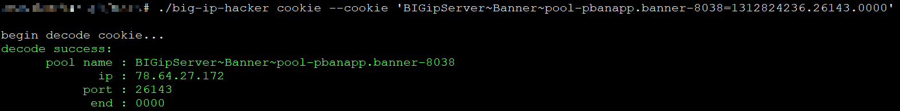
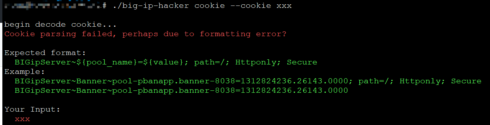
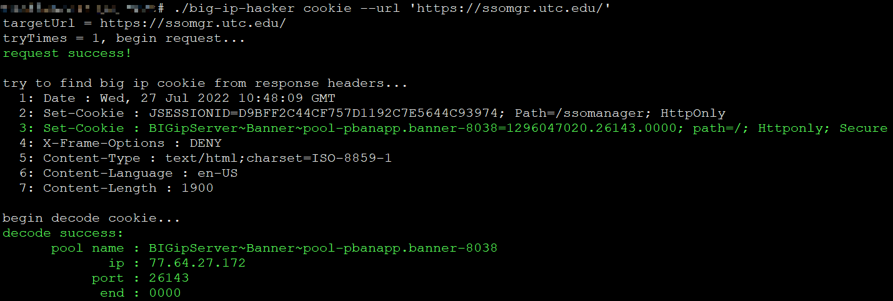
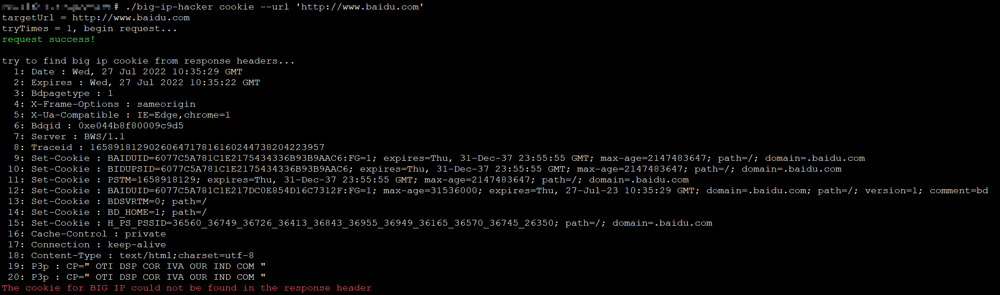

# Big IP Hacker

# 一、简介

Big IP安全相关工具。



# 二、 功能列表

- Cookie Decoder

# 三、Cookie Decoder

# 3.1 Cookie功能概览 



输入Cookie解密：

```text
./big-ip-hacker cookie --cookie 'xxx'
```

或者觉得打开浏览器的开发者工具复制太麻烦，直接从地址栏中复制URL，输入URL，根据HTTP请求响应头上的Cookie来解密：

```text
./big-ip-hacker cookie --url 'xxx'
```

## --cookie 

用法：

```bash
./big-ip-hacker cookie --cookie 'BIGipServer~Banner~pool-pbanapp.banner-8038=1312824236.26143.0000'
```




输入非法时的提示：



## --url 

用法：

```bash
 ./big-ip-hacker cookie --url 'https://ssomgr.utc.edu/'
```




如果输入的url没有使用big ip： 




# 四、安装

## 4.1 Release下载 

去release页面下载

## 4.2 手动编译

项目克隆到本地：

```bash 
git clone https://github.com/CC11001100/big-ip-hacker.git 
```

Windows CMD编译：

```bash 
SET CGO_ENABLED=0
SET GOOS=windows
SET GOARCH=amd64
go build -o gitlab-api-user-enum-exploit.exe main.go
```

Linux编译：

```bash
CGO_ENABLED=0 GOOS=linux GOARCH=amd64 go build -o gitlab-api-user-enum-exploit main.go
```

# 五、案例网站

## 5.1 旧

```text
https://ssomgr.utc.edu/
https://185.26.210.10/
https://170.140.125.22/
https://167.16.66.73/
https://185.109.109.36/
```

## 5.2 新

```text
https://iam.cloud.nec.com/
```


# 六、TODO

对新的方式的cookie解密 


